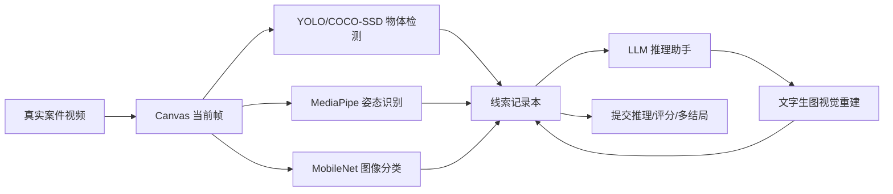

# Neon Detective AI

剧情驱动的互动侦探游戏。玩家进入开发者预设的视频案件，通过视频帧分析、物体检测、姿态识别、图像分类、LLM 推理和文字生图视觉重建来收集线索，最后提交推理并获得评分与多结局。

## 技术栈

- React 18 + TypeScript + Vite
- Tailwind CSS + shadcn/ui 风格组件
- Framer Motion 动画
- Zustand 状态管理和本地持久化
- TensorFlow.js / COCO-SSD 物体检测接入
- TensorFlow.js / MobileNet 图像分类接入
- MediaPipe Tasks Vision 姿态识别接入
- OpenAI Responses API：LLM 对话助手
- OpenAI Images API：文字生图视觉重建
- Howler.js 音效
- Canvas API 视频叠加层

## 运行

```bash
npm install
npm run dev
```

生产构建：

```bash
npm run build
```

可选 OpenAI 中转配置，复制 `.env.local.example` 为 `.env.local`：

```bash
OPENAI_BASE_URL=https://api.pophcc.com
OPENAI_MODEL=gpt-5.5
OPENAI_IMAGE_MODEL=gpt-image-1
OPENAI_REASONING_EFFORT=xhigh
OPENAI_API_KEY=sk-...
```

API Key 只由 Vite 本地代理读取，不会打包到浏览器代码。LLM 走 `/api/assistant`，文字生图走 `/api/reconstruct`。没有网络或 Key 时，游戏会保留离线兜底结果，保证流程能演示。

## AI 工具链



当前视觉模型是“真实依赖接入 + 预设案件结果兜底”的稳定演示形态；核心入口在 `src/lib/ai/analyzers.ts`。LLM 和文字生图已经通过本地代理接入 OpenAI 兼容中转。

## 视频素材与叙事处理

项目已放入 3 个真实视频文件，位于 `public/assets/videos/`。这些素材被用作“监控片段氛围素材”，案件可推理信息由页面上的背景档案、关键时间轴、AI 叠加标注和线索本共同承载，避免玩家只靠随机视频猜答案。

- `case-museum-real.mp4`：暗色通道/监控质感，用作展厅案件氛围视频。
- `case-alley-real.mp4`：雨夜街景，用作雨巷胶片案件视频。
- `case-harbor-real.mp4`：暗色水面/港口氛围，用作港口案件视频。

素材来自 Free Stock Footage Archive，作为本地课堂项目演示使用。若用于公开发布，请重新核验每个素材页面的最新授权条款，并保留来源说明或替换为自制视频。最理想的最终版是录制自制案件视频，让画面、线索和答案完全一一对应。

## 项目结构

```text
src/
  components/        页面和 shadcn/ui 风格组件
  data/              案件、工具、成就与答案数据
  lib/ai/            AI 适配层、OpenAI 前端调用、离线兜底
  store/             Zustand 游戏状态
  types/             TypeScript 类型
public/assets/       视频、音频和视觉资源
docs/                项目说明报告
```

## 演示重点

1. 从首页进入案件，播放真实视频素材。
2. 使用物体检测、姿态识别、场景分类解锁线索。
3. 用 LLM 助手询问线索关系。
4. 用视觉重建器生成案发过程图，并把它加入线索链。
5. 提交推理，展示评分、雷达图、星级和结局文本。
