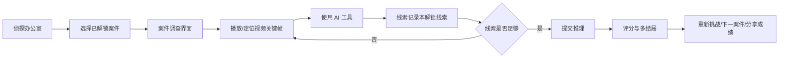
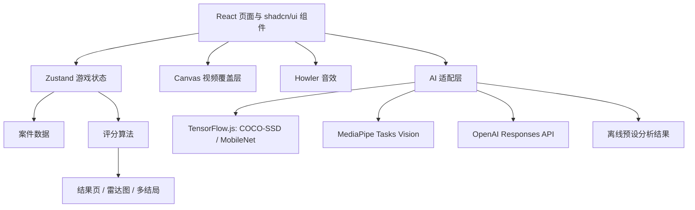

# 项目说明报告

## 项目目标

《霓虹疑案 AI Detective》是一个剧情驱动的互动侦探游戏。核心体验是让玩家围绕开发者预设的视频案件使用多种 AI 工具做证据提取，再通过推理提交系统完成破案。

## 用户流程

## 技术架构

## 模块说明

- `DetectiveOffice`：主界面，展示 3 个案件、玩家等级、破案率、成就和本地榜。
- `InvestigationPage`：案件调查容器，管理倒计时、提交入口、视频区、工具区、线索本和聊天助手。
- `VideoAnalyzer`：自定义播放器，提供播放、暂停、快进、后退、循环、进度条、扫描线和 Canvas AI 覆盖层。
- `AIToolbox`：四类 AI 工具入口，管理加载状态、次数扣减、结果摘要、场景标签云和动作时间轴。
- `ClueNotebook`：线索卡片列表，线索解锁时使用 Framer Motion 翻转动画。
- `DeductionDialog`：犯人单选、作案工具多选、动机文本输入。
- `ResultPage`：星级、总分、雷达图、AI 导演评语、多结局和分享入口。

## AI 策略

当前实现采用“真实接入点 + 离线兜底”的方式：

1. 玩家点击工具时，前端按需导入 TensorFlow.js、MediaPipe 或分类模型依赖。
2. 若模型文件可用，可在 `src/lib/ai/analyzers.ts` 中替换为真实帧推理。
3. 若模型加载失败或网络不可用，则使用案件数据中预设的分析结果。
4. LLM 助手优先调用本地 `/api/assistant` 代理，再由代理请求 OpenAI Responses API 中转；没有 `OPENAI_API_KEY` 时使用离线推理助手。
5. AI Worker 接口已预留在 `src/workers/aiWorker.ts`，用于后续把重计算移出主线程。

## 评分算法

总分由四部分加权：

- 线索完整度：34%
- 推理准确度：36%
- 时间效率：16%
- 工具使用效率：14%

星级规则：

- 92+：5 星，完美结局
- 78-91：4 星
- 62-77：3 星，良好结局
- 45-61：2 星
- 45 以下：1 星，普通结局

## 响应式设计

- 桌面端：视频与 AI 工具箱左右分栏。
- 平板端：区域自然上下堆叠。
- 移动端：视频占满主要视野，工具与线索下移，聊天助手固定右下角并可折叠。

## 可访问性

- 关键按钮使用 `aria-label`。
- 对话框使用 Radix Dialog，支持焦点管理和键盘关闭。
- 表单控件使用 Label、RadioGroup、Checkbox。
- 主题颜色保持深色背景下高对比度，霓虹黄仅用于重点和状态提示。

## 性能优化

- 视频素材懒加载，播放器使用 `preload="metadata"`。
- AI 模型按需导入。
- 分析结果按案件、工具和时间片缓存。
- Worker 通道已预留。
- SVG 和 WAV 素材体积轻，适合本地演示。

## 团队分工建议

- 前端交互：页面、组件、动画、响应式适配。
- AI 工程：真实模型加载、帧采样、Worker 推理、结果缓存。
- 内容设计：案件脚本、嫌疑人设定、线索与多结局文本。
- 测试与发布：跨浏览器验证、性能检查、录屏演示、README 维护。

## 已知边界

- 当前案件“视频素材”为轻量 SVG 监控风格素材，并提供模拟时间轴兜底，不是实拍 MP4。
- YOLO、MediaPipe 和分类模型保留接入点，默认用预设分析结果保证无网络可玩。
- 当前已通过 Vite 本地代理隐藏 OpenAI Key，并加入简单本地速率限制。生产环境应迁移到正式后端代理，继续保留审计、限流和密钥轮换。
